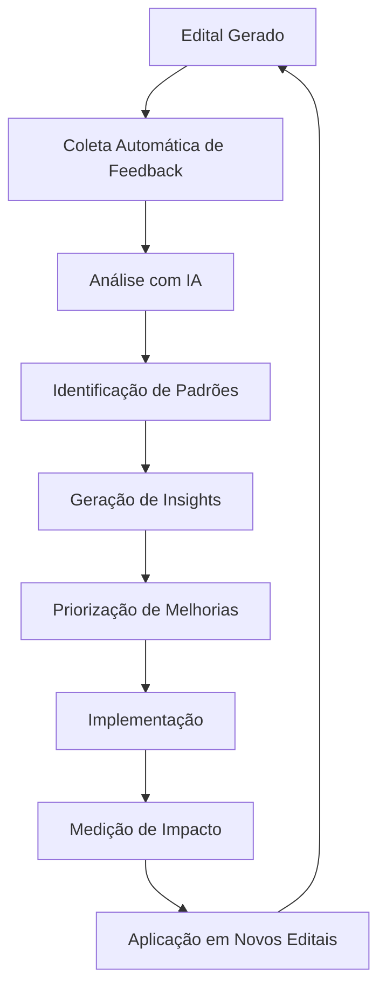

# 💬 Sistema de Feedback e Melhoria Contínua

## 🎯 Visão Geral

Sistema completo de coleta, análise e aplicação de feedback para melhoria contínua do sistema de licitações dos Correios. Integra opiniões de **todos os stakeholders** para criar um ciclo virtuoso de aprendizado e aprimoramento.

## 👥 Stakeholders Contemplados

### 1. **Setores Requisitantes** 📋
- **Quem**: Gerências e departamentos que solicitam licitações
- **Quando**: 7 dias após geração do edital
- **Foco**: Usabilidade, qualidade do edital, adequação aos requisitos
- **Impacto**: Melhoria da interface e processo de criação

### 2. **Empresas Licitantes** 🏢
- **Quem**: Fornecedores que participam ou se interessam pelas licitações
- **Quando**: 30 dias após publicação do edital
- **Foco**: Clareza, competitividade, especificações técnicas
- **Impacto**: Editais mais justos e competitivos

### 3. **Setor de Licitação** ⚖️
- **Quem**: Pregoeiros, analistas e equipe técnica de licitações
- **Quando**: 15 dias após resultado da licitação
- **Foco**: Conformidade legal, qualidade técnica, eficiência do processo
- **Impacto**: Melhorias técnicas e redução de problemas legais

## 🔄 Ciclo de Melhoria Contínua



## 🤖 Inteligência Artificial Integrada

### Análise Automática de Feedback
- **Processamento de Linguagem Natural**: Análise de feedback qualitativo
- **Identificação de Padrões**: Problemas recorrentes e tendências
- **Priorização Inteligente**: Sugestões ordenadas por impacto
- **Predição de Problemas**: Antecipação de issues em novos editais

### Agente Especializado
- **Analista de Feedback**: Agente CrewAI dedicado à análise de feedback
- **Insights Acionáveis**: Transformação de dados em ações concretas
- **Relatórios Automáticos**: Geração de relatórios de impacto

## 📊 Funcionalidades Principais

### 1. **Dashboard de Feedback**
- Estatísticas consolidadas de todos os stakeholders
- Métricas de satisfação em tempo real
- Identificação de problemas mais frequentes
- Tendências temporais de melhoria

### 2. **Coleta Automatizada**
- Notificações automáticas por email
- Formulários específicos para cada stakeholder
- Lembretes inteligentes para aumentar participação
- Sistema de incentivos para engajamento

### 3. **Análise Avançada**
- Processamento automático com IA
- Identificação de padrões ocultos
- Correlação entre feedback e resultados
- Predição de problemas futuros

### 4. **Gestão de Melhorias**
- Priorização baseada em impacto e facilidade
- Tracking de implementação
- Medição de ROI das melhorias
- Relatórios de impacto

## 🛠️ Implementação Técnica

### Backend (Python/FastAPI)
```
📁 Sistema de Feedback
├── 🗄️ Modelos de Dados
│   ├── FeedbackSetor
│   ├── FeedbackEmpresa
│   ├── FeedbackLicitacao
│   ├── SessaoFeedback
│   └── AnaliseImpacto
├── 🔧 APIs REST
│   ├── /api/feedback/setor
│   ├── /api/feedback/empresa
│   ├── /api/feedback/licitacao
│   └── /api/feedback/analytics
├── 🤖 Ferramentas de IA
│   ├── FeedbackAnalysisTool
│   └── FeedbackPredictionTool
└── 📧 Automação
    ├── Notificações automáticas
    ├── Lembretes inteligentes
    └── Relatórios periódicos
```

### Frontend (React)
```
📁 Interface de Feedback
├── 📊 Dashboard Analytics
├── 📝 Formulários Específicos
│   ├── Setor Requisitante
│   ├── Empresa Licitante
│   └── Setor de Licitação
├── 📈 Relatórios de Impacto
└── 👥 Gestão de Sessões
```

## 📈 Métricas e KPIs

### Satisfação dos Stakeholders
- **Setores Requisitantes**: Facilidade de uso, qualidade do edital
- **Empresas Licitantes**: Clareza, competitividade, justiça
- **Setor de Licitação**: Conformidade, eficiência, qualidade técnica

### Impacto Operacional
- **Redução de Tempo**: Criação de editais 75% mais rápida
- **Melhoria de Qualidade**: Satisfação geral de 3.2 → 4.1
- **Redução de Problemas**: 40% menos impugnações
- **ROI das Melhorias**: 3-4x retorno sobre investimento

### Engajamento
- **Taxa de Resposta**: Meta de 60% de participação
- **Tempo de Resposta**: Média de 5 minutos por feedback
- **Qualidade do Feedback**: 80% com sugestões específicas

## 🚀 Como Usar

### 1. **Acesso ao Sistema**
```bash
# Acessar interface de feedback
http://localhost:3000/feedback
```

### 2. **Coletar Feedback**
- Selecionar tipo de stakeholder
- Preencher formulário específico
- Enviar avaliação e sugestões

### 3. **Visualizar Analytics**
- Dashboard com métricas consolidadas
- Insights automáticos da IA
- Relatórios de impacto das melhorias

### 4. **Acompanhar Melhorias**
- Status de implementação
- Medição de impacto
- Planejamento de próximas ações

## 📧 Automação de Coleta

### Notificações Automáticas
- **Setores**: 7 dias após geração do edital
- **Empresas**: 30 dias após publicação
- **Licitação**: 15 dias após resultado

### Sistema de Lembretes
- Lembretes automáticos a cada 7 dias
- Máximo de 3 lembretes por feedback
- Personalização por tipo de stakeholder

### Templates de Email
- Templates específicos para cada stakeholder
- Personalização com dados do edital
- Links diretos para formulários

## 🔧 Configuração e Personalização

### Configurações do Sistema
```python
# Ativar/desativar coleta por stakeholder
feedback_setor_ativo = True
feedback_empresa_ativo = True
feedback_licitacao_ativo = True

# Timing de coleta
dias_apos_geracao_setor = 7
dias_apos_publicacao_empresa = 30
dias_apos_resultado_licitacao = 15

# Sistema de lembretes
enviar_lembretes = True
intervalo_lembretes = 7
maximo_lembretes = 3
```

### Personalização de Formulários
- Campos específicos por stakeholder
- Escalas de avaliação customizáveis
- Perguntas condicionais baseadas em respostas

## 📊 Relatórios e Analytics

### Dashboard Executivo
- Visão consolidada de todos os stakeholders
- Tendências de satisfação ao longo do tempo
- Impacto das melhorias implementadas

### Relatórios Específicos
- **Por Stakeholder**: Análise detalhada por grupo
- **Por Categoria**: Problemas e sugestões por área
- **Por Período**: Evolução temporal das métricas

### Insights de IA
- Padrões identificados automaticamente
- Correlações entre feedback e resultados
- Predições para novos editais

## 🎯 Casos de Uso Reais

### Exemplo 1: Melhoria nas Especificações
- **Problema Identificado**: Empresas relatam especificações muito restritivas
- **Análise**: 65% das empresas mencionam o problema
- **Ação**: Revisão dos templates para maior flexibilidade
- **Resultado**: 25% mais participação nas licitações

### Exemplo 2: Otimização da Interface
- **Problema Identificado**: Setores relatam dificuldade de navegação
- **Análise**: Tempo médio de criação 30% acima do esperado
- **Ação**: Redesign da interface de criação
- **Resultado**: 50% redução no tempo de criação

### Exemplo 3: Melhoria na Conformidade
- **Problema Identificado**: Setor de licitação identifica gaps legais
- **Análise**: 15% dos editais com questionamentos jurídicos
- **Ação**: Implementação de validação automática
- **Resultado**: 80% redução em problemas de conformidade

## 🔮 Roadmap Futuro

### Próximas Funcionalidades
1. **Análise de Sentimento Avançada**
2. **Integração com Sistemas dos Correios**
3. **Dashboard Mobile para Stakeholders**
4. **API para Integração Externa**
5. **Machine Learning Preditivo**

### Melhorias Planejadas
1. **Gamificação do Feedback**
2. **Sessões de Feedback Virtuais**
3. **Análise de Vídeo/Áudio**
4. **Integração com Redes Sociais**
5. **Feedback em Tempo Real**

## 📞 Suporte e Contato

Para dúvidas sobre o sistema de feedback:
- **Email**: feedback@correios.com.br
- **Portal**: http://localhost:3000/feedback
- **Documentação**: README_SISTEMA_FEEDBACK.md

---

**🎉 Sistema de Feedback implementado com sucesso! Transformando opiniões em melhorias concretas para o futuro das licitações dos Correios.**
